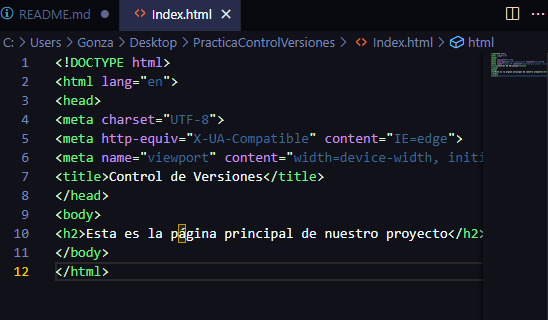

# Explicación

### Profesor : Raul Reyes Mangano

### Alumno : Gonzalo Nahuel García de León

___

# Indice

* [Imagen 1 : Creación respositorio local](#crear-un-repositorio-local)

* [Imagen 2 :Se comprueba por primera vez el estado](#comprobar-el-estado)

* [Imagen 3 :Creacion de Index.html](#se-crea-index)

* [Imagen 4 :Se añaden cambios a zona de stage ](#se-añaden-los-cambios-a-la-zona-de-stage)

* [Imagen 5 :Se comprueba el estado nuevamente ](#se-comprueba-el-estado-nuevamente)

* [Imagen 6 :Primer commit ](#se-realiza-un-commit-con-los-cambios)

* [Imagen 7 :Se comprueba el estado despues del commit ](#se-comprueba-el-estado-despues-del-commit)

* [Imagen 8 :Se crean principal.css y principal.js ](#se-crean-los-archivos-principal-css-y-javascript)

* [Imagen 9 :Se añaden a la zona de stage principal.css y principal.js ](#se-añaden-a-la-zona-de-stage)

* [Imagen 10 :Se elimina principal.js ](#se-elimina-principal-javascript)

* [Imagen 11 :Se vuelve a crear principal.js ](#se-vuelve-a-crear-principal-javascript)

* [Imagen 12 :Se añade a zona de stage ](#se-añade-a-zona-de-stage)

* [Imagen 13 :Se realiza un commit con el archivo principal.js ](#Commit-principalJS)

* [Imagen 14 :Se modifica principal.css ](#Modificación-de-CSS)

* [Imagen 15 :Se comprueba cambios](#cambios-entre-archivo-y-repositorio)

* [Imagen 16 :Se eliminan cambios en principal.css](#se-eliminan-cambios-en-css)

* [Imagen 17 :se asigna el repositorio local al remoto](#se-asigna-el-repositorio-local-al-remoto)

* [Imagen 18 :Se sube la rama master](#subir-rama-master)

* [Imagen 19 :Se comprueba los archivos subidos](#comprobar-github)

* [Imagen 20 :Se crea la rama develop](#crear-nueva-rama)

* [Imagen 20 :Se hace un push a develop](#push-otrojavascript)

---
## Crear un repositorio local
 Se comienza creando un repositorio local con el comando git init.

---
## Comprobar el estado

Se comprueba el estado mediante el comando git status.

---
## Se crea index

Se crea un archivo html llamado index.

---
## Se añaden los cambios a la zona de stage

Los cambios previamente hechos se agregan a la zona de stage mediante el comando git add . .

---
## Se comprueba el estado nuevamente

Se vuelve a usar el comando git status para comprobar el estado del repositorio.

---
## Se realiza un commit con los cambios

Se realiza el commit con el comando commit -m "".

---
## Se comprueba el estado despues del commit

Se vuelve a usar el comando git status para comprobar el estado del repositorio.

---
## Se crean los archivos principal css y javascript

se cran en el IDE los dos archivos llamdos principal.

---
## Se añaden a la zona de stage

Se añaden a la zona de stage mediante el comando git add . . 

---
## Commit archivos principal

Se realiza un commit añadiendo los archivos principal.

---
## Se elimina principal javascript

Se elimina del repositorio y del directorio principal.js mediante el comando git rm.

---
## Se vuelve a crear principal javascript

---
## Se añade a zona de stage

---
## Commit principalJS

Se realiza un commit añadiendo el archivo principal.js.

---
## Modificación de CSS

Se modifica el archivo CSS de la siguiente manera.

---
## Cambios entre archivo y repositorio

Se comprueban los cambios mediante el comando git diff.

---
## Se eliminan cambios en CSS

Se eliminan los cambios en CSS desde el ultimo commit. 

---
## se asigna el repositorio local al remoto

se asigna usando el comando git remote add origin

---
## Subir rama master

Se sube la rama master mediante el comando git push -u origin main

---
## Comprobar github

Se comprueba que todos los archivos se subieron

---
## Crear nueva rama

se crea una rama mediante el comando git branch "" y se mueve a ella mediante el comando git checkout

---
## Push otrojavascript

Se crea un archivo llamdo otrojavascript.js se utiliza git add, git commit y git push

---
## Mostrar ramas

con el comando git diff develop master

---